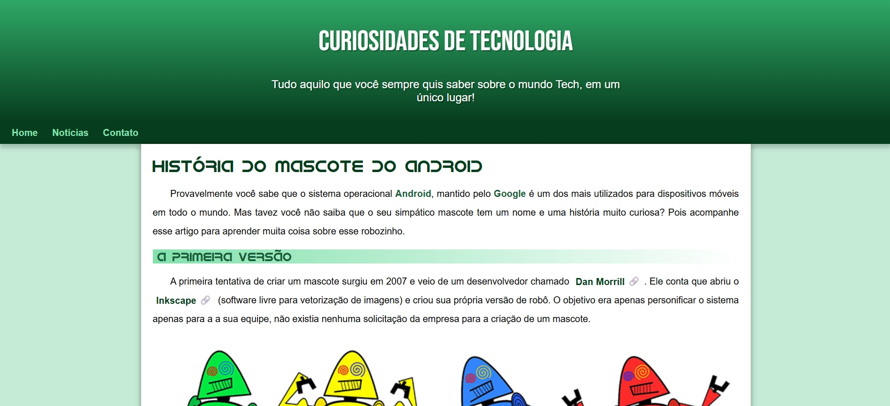

# 🌐 Projeto de Site Responsivo

Este é o meu primeiro projeto de **site responsivo**, desenvolvido como parte das aulas do **Módulo 2** do [Curso em Vídeo](https://www.cursoemvideo.com/) ministrado por Gustavo Guanabara.  
O objetivo foi praticar **HTML5** e **CSS3** com foco em **responsividade**, adaptando o conteúdo para diferentes tamanhos de tela.

---

## 🖼️ Demonstração

👉 [Acesse o projeto online](https://brrn91.github.io/site-responsivo/)

---

## 🛠️ Tecnologias Utilizadas

- **HTML5**
- **CSS3**
- Estruturação semântica e boas práticas de organização

---

## ⚙️ Funcionalidades

- ✅ Estrutura de página institucional
- ✅ Elementos estilizados com CSS
- ✅ Layout simples e responsivo
- 🚀 Hospedado facilmente no GitHub Pages

---

💡 **Nota:** Este projeto faz parte do meu aprendizado e portfólio. Feedbacks são sempre bem-vindos! 😊
